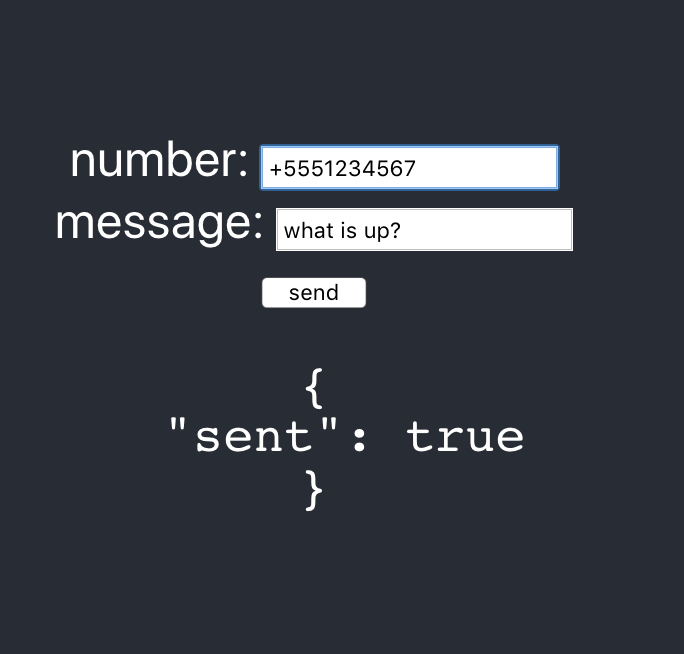

# services-edu-experiments

A React project for experimenting with using https://github.com/kevinrobinson/services-edu to do things like search for images, search for videos, send text messages, and reply to incoming text messages.

### Image search
https://services-edu-experiments.herokuapp.com/images

### Video search
https://services-edu-experiments.herokuapp.com/videos

### Sending text messages
https://services-edu-experiments.herokuapp.com/texts/send

## Getting started
### `yarn start`

Runs the app in the development mode. 
Open [http://localhost:3000](http://localhost:3000) to view it in the browser.

The page will reload if you make edits. 
You will also see any lint errors in the console.

This project was bootstrapped with [Create React App](https://github.com/facebook/create-react-app).
